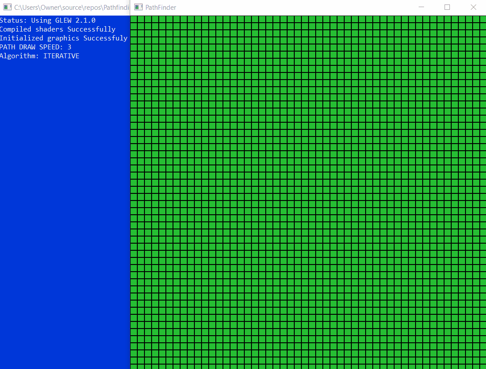

# PathfindingVisualization
#### A program that shows path finding graphics.

Controls:
Key controls:
- A key - Change algorithm
- S key - Run the algorithm
- R key - Reset grid
- Up and Down arrow keys - Speed up or slow down algorithm search speed

Mouse controls:
- Mouse left click - Crate walls
- Mouse left double click - remove walls
- Mouse right click - Create/move the starting node 
- Mouse right double click - create/move destination node 
